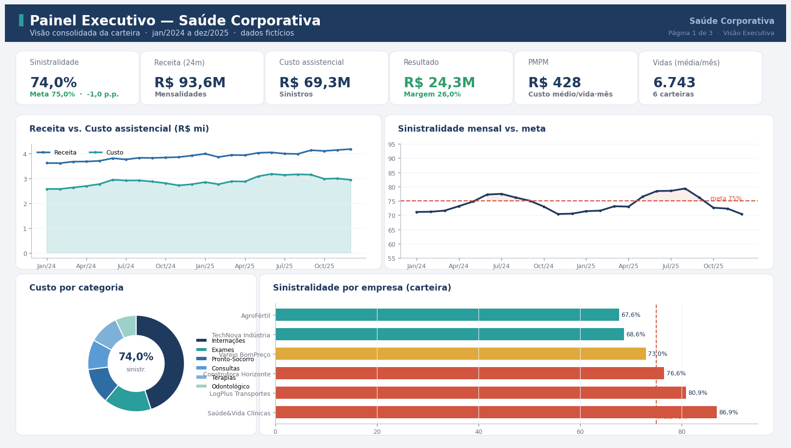
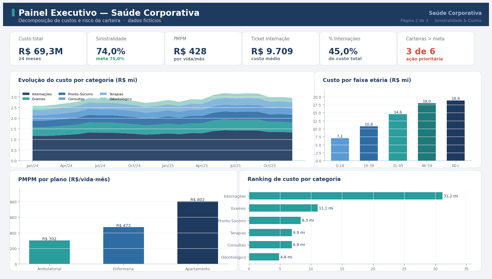
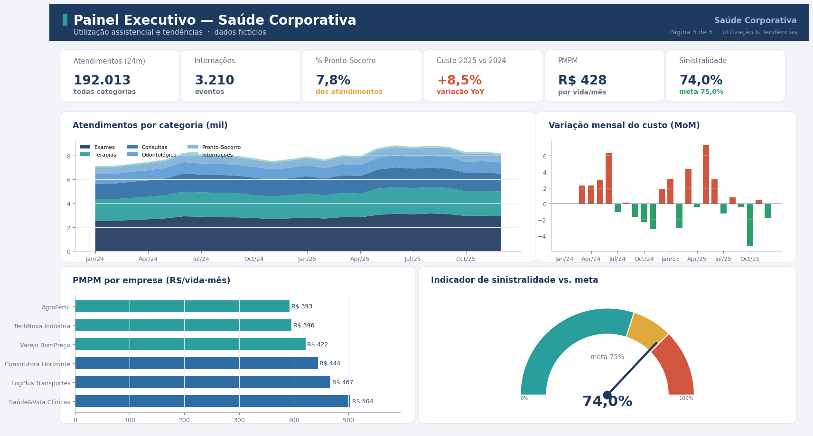

# 📊 Painel Executivo de Saúde Corporativa (Power BI + Python)


-2a9d9d?style=flat-square)


### 🔴 [Acesse a demo web interativa →](https://anapaula-galdino.github.io/painel-saude-corporativa-powerbi/)

> Réplica web do dashboard (JavaScript + Chart.js) com filtros por carteira e plano. O **núcleo do projeto é Power BI** — medidas DAX, Power Query (M) e tema próprio estão em [`powerbi/`](powerbi/).

Painel executivo para a **gestão de uma carteira de saúde corporativa**, com foco em **sinistralidade**, **custo per capita (PMPM)** e **utilização assistencial**. O projeto cobre o ciclo completo de BI: geração e modelagem dos dados em **Python**, modelo em **esquema estrela**, medidas em **DAX**, transformação em **Power Query (M)**, tema próprio e um **relatório executivo** com recomendações.

> 🔎 Os dados são **fictícios**, gerados por script apenas para demonstração. Nenhuma informação real de beneficiários é utilizada.

---

## 🎯 Contexto de negócio

Plano de saúde costuma ser o **segundo maior custo da folha** e o de menor previsibilidade. Gerir bem exige acompanhar de perto a relação entre o que se arrecada (mensalidades) e o que se gasta (sinistros). Este painel responde às perguntas que a liderança faz todo mês:

- A carteira está **dentro da meta de sinistralidade** (75%)?
- **Quais empresas** concentram o risco?
- **Onde** o dinheiro está sendo gasto (categorias, faixas etárias, planos)?
- A utilização está **subindo ou caindo** — e por quê?

## 📈 Principais resultados (período de 24 meses)

| Indicador | Valor |
|---|---|
| Sinistralidade global | **74,0%** (meta 75%) |
| PMPM (custo por vida/mês) | **R$ 428** |
| Receita (mensalidades) | **R$ 93,6 mi** |
| Custo assistencial | **R$ 69,3 mi** |
| Resultado (margem 26%) | **R$ 24,3 mi** |
| Vidas (média/mês) | **6.743** |

**Insights:** apesar do global dentro da meta, **3 das 6 carteiras** operam acima de 75% (Saúde&Vida 86,9%, LogPlus 80,9% e Construtora Horizonte 76,6%) e concentram o risco; **internações** e **exames** lideram o custo; o custo cresce forte nas faixas **46-59** e **60+**; há picos sazonais de sinistralidade no inverno.

## 🖥️ O painel

**Página 1 — Visão Executiva**


**Página 2 — Sinistralidade & Custos**


**Página 3 — Utilização & Tendências**


## 🧱 Modelo de dados (esquema estrela)

Duas tabelas-fato (`fato_sinistros` e `fato_carteira`) compartilhando dimensões conformadas. Detalhes em **[powerbi/modelo_dados.md](powerbi/modelo_dados.md)**.


## 🧮 Artefatos de Power BI

| Arquivo | Conteúdo |
|---|---|
| [`powerbi/medidas.dax`](powerbi/medidas.dax) | Medidas DAX: sinistralidade, PMPM, margem, MoM/YoY, YTD, ranking e formatação condicional |
| [`powerbi/powerquery.m`](powerbi/powerquery.m) | Scripts Power Query (M) de ingestão e tipagem das tabelas |
| [`powerbi/tema_executivo_azul.json`](powerbi/tema_executivo_azul.json) | Tema personalizado do Power BI |
| [`powerbi/modelo_dados.md`](powerbi/modelo_dados.md) | Documentação do modelo e relacionamentos |

## 📄 Relatório executivo

[**Relatorio_Executivo_Saude_Corporativa.pdf**](relatorio/Relatorio_Executivo_Saude_Corporativa.pdf) — sumário, análises por página e recomendações.

## 🛠️ Tecnologias

Power BI (DAX · Power Query/M · tema) · Python (pandas, numpy, matplotlib) · modelagem dimensional (star schema).

## 📁 Estrutura

```
painel-saude-corporativa-powerbi/
├── dados/        # CSVs do modelo estrela (fatos e dimensões)
├── src/          # Python: geração de dados, ETL e renderização das telas
├── powerbi/      # medidas.dax, powerquery.m, tema .json, modelo_dados.md
├── imagens/      # telas do painel + diagrama do modelo
├── relatorio/    # relatório executivo em PDF
├── docs/         # demo web interativa (GitHub Pages)
└── README.md
```

## ▶️ Como reproduzir

```bash
pip install pandas numpy matplotlib reportlab
python src/gerar_dados.py      # gera o dataset fictício (modelo estrela)
python src/painel.py           # renderiza as 3 telas do painel
python src/build_relatorio.py  # gera o relatório executivo em PDF
```

No Power BI Desktop: importe os CSVs de `dados/`, aplique os passos de `powerbi/powerquery.m`, crie as medidas de `powerbi/medidas.dax` e o tema `powerbi/tema_executivo_azul.json`.

---

Feito por **Ana Paula Galdino** · [LinkedIn](https://linkedin.com/in/galdinoana/) · [GitHub](https://github.com/AnaPaula-Galdino)
