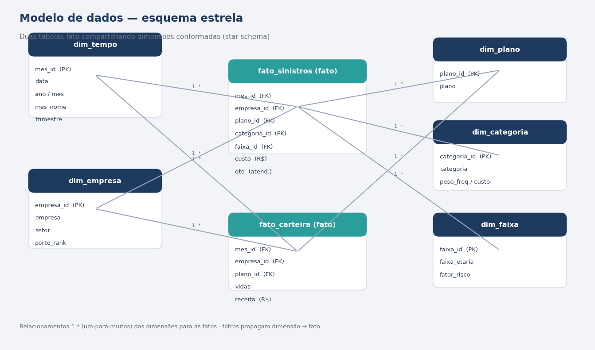

# Modelo de dados — esquema estrela

O modelo segue um **star schema** com duas tabelas-fato que compartilham dimensões conformadas. Esse desenho mantém o relacionamento simples (1:\*), as medidas DAX performáticas e a navegação intuitiva para o usuário de negócio.

## Tabelas-fato

| Tabela | Grão (granularidade) | Métricas |
|---|---|---|
| `fato_sinistros` | mês × empresa × plano × categoria × faixa etária | `custo` (R$), `qtd` (atendimentos) |
| `fato_carteira` | mês × empresa × plano | `vidas`, `receita` (R$) |

Manter receita/vidas em uma fato separada (grão mais alto) evita inflar valores ao cruzar com a fato de sinistros — boa prática para indicadores como **sinistralidade** e **PMPM**.

## Dimensões

| Dimensão | Chave | Atributos principais |
|---|---|---|
| `dim_tempo` | `mes_id` | data, ano, mês, mês_nome, trimestre |
| `dim_empresa` | `empresa_id` | empresa, setor, porte |
| `dim_plano` | `plano_id` | plano (Ambulatorial / Enfermaria / Apartamento) |
| `dim_categoria` | `categoria_id` | categoria de utilização |
| `dim_faixa` | `faixa_id` | faixa etária, fator de risco |

## Relacionamentos

Todos no padrão **1:\*** (um para muitos), com filtro de direção única da dimensão para a(s) fato(s):

- `dim_tempo[mes_id]` → `fato_sinistros[mes_id]` e `fato_carteira[mes_id]`
- `dim_empresa[empresa_id]` → ambas as fatos
- `dim_plano[plano_id]` → ambas as fatos
- `dim_categoria[categoria_id]` → `fato_sinistros`
- `dim_faixa[faixa_id]` → `fato_sinistros`

## Indicadores-chave (DAX)

As medidas estão em [`medidas.dax`](medidas.dax). Destaques:

- **Sinistralidade** = `Custo Assistencial / Receita` (meta de 75%).
- **PMPM** (Per Member Per Month) = `Custo / Vidas-Mês`.
- **Ticket médio**, **Margem**, **% Internações**, **% Pronto-Socorro**.
- Inteligência de tempo: **MoM %**, **YoY %**, **YTD**.
- **Ranking de empresas** por PMPM e **formatação condicional** por faixa de sinistralidade.

> Dados **fictícios**, gerados por script (`src/`) apenas para demonstração do modelo e das análises.
